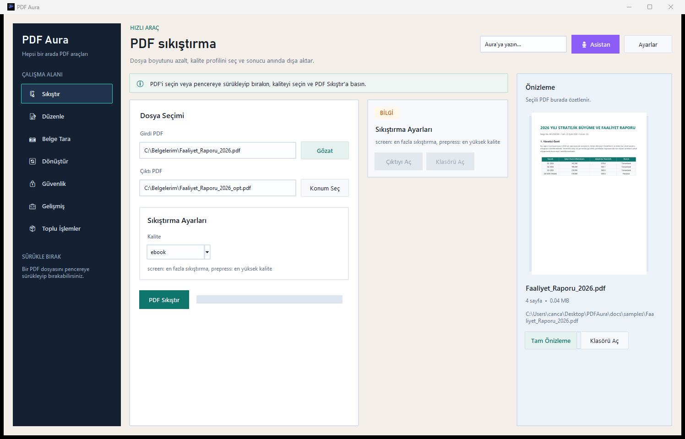
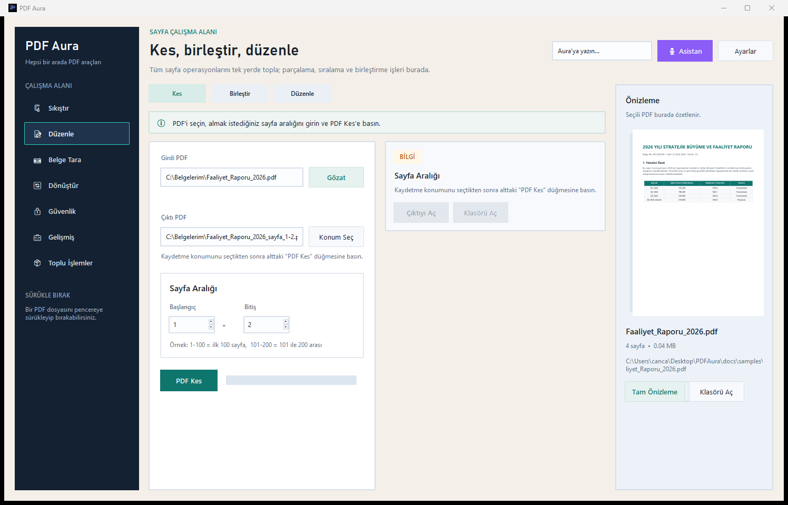
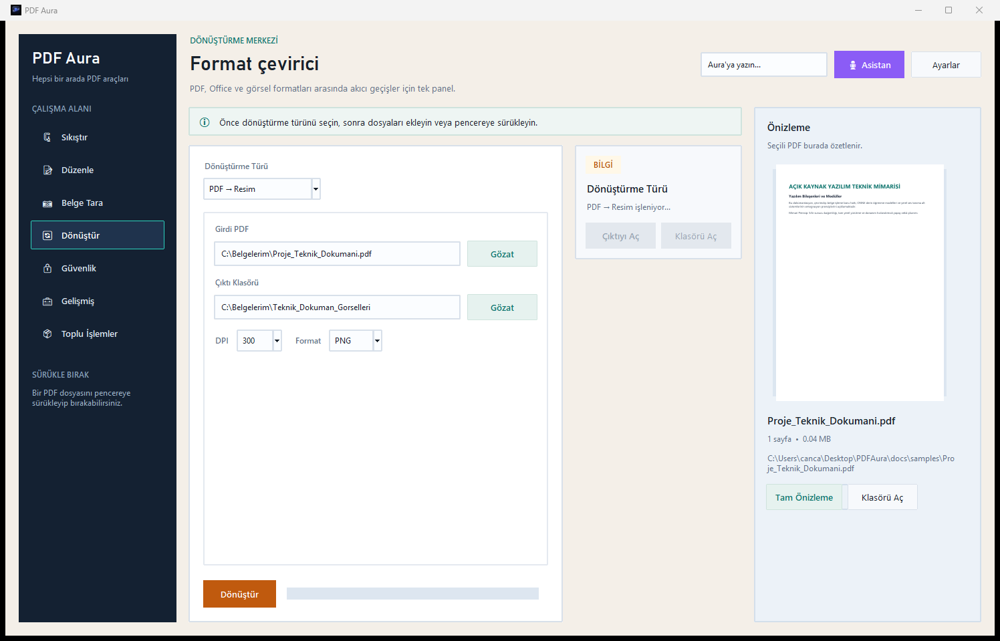
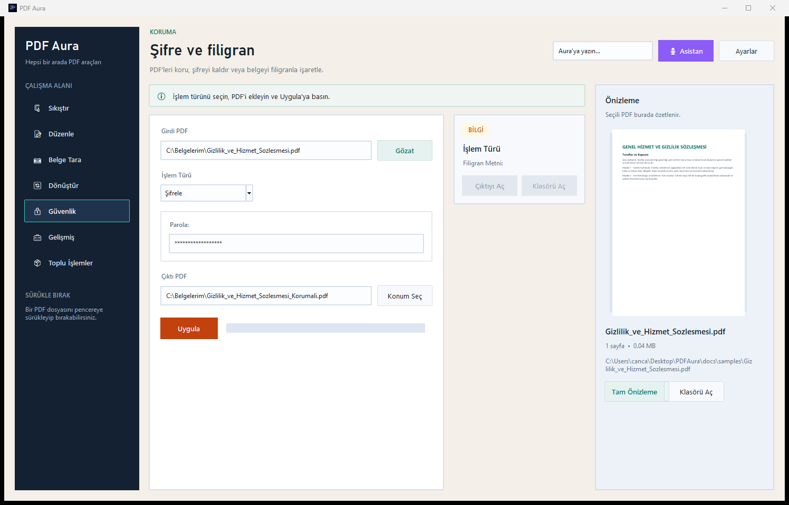
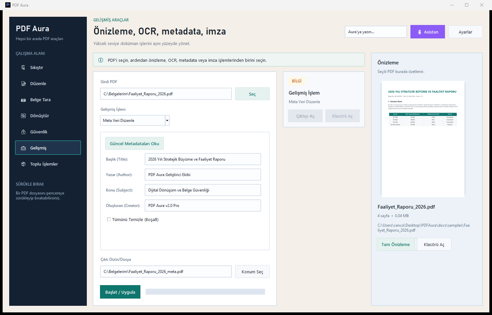
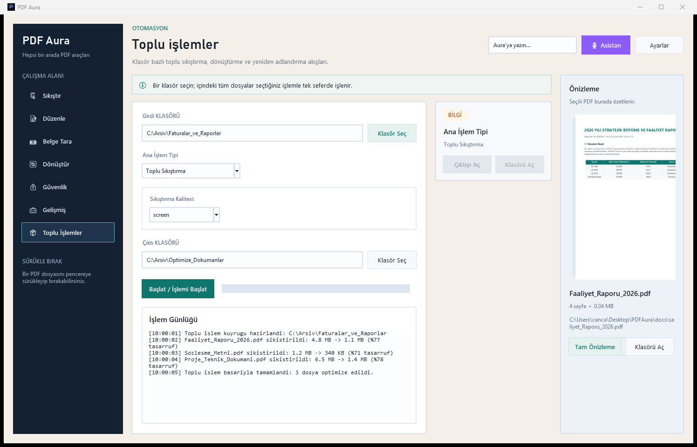
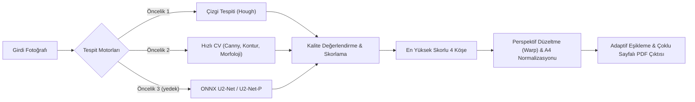

<p align="center">
  
</p>

<h1 align="center">PDF Aura</h1>

<p align="center">
  <b>Windows için Çevrimdışı, Gizlilik Odaklı ve Yapay Zekâ Destekli Hepsi Bir Arada PDF İsviçre Çakısı</b>
</p>

<p align="center">
  
  
  
  
  
  
</p>

---

## 📌 İçindekiler
- [🌟 Neden PDF Aura?](#-neden-pdf-aura)
- [📸 Ekran Görüntüleri ve Tanıtım Vitrini](#-ekran-görüntüleri-ve-tanıtım-vitrini)
  - [1. Akıllı Belge Tarayıcı (AI Destekli)](#1-akıllı-belge-tarayıcı-ai-destekli)
  - [2. Akıllı PDF Sıkıştırma](#2-akıllı-pdf-sıkıştırma)
  - [3. Sayfa Yönetimi (Kes, Birleştir, Düzenle)](#3-sayfa-yönetimi-kes-birleştir-düzenle)
  - [4. Kapsamlı Format Dönüştürücü](#4-kapsamlı-format-dönüştürücü)
  - [5. Güvenlik ve Filigran Koruma](#5-güvenlik-ve-filigran-koruma)
  - [6. Gelişmiş Araçlar, OCR ve Meta Veri](#6-gelişmiş-araçlar-ocr-ve-meta-veri)
  - [7. Toplu İşlemler ve Otomasyon](#7-toplu-işlemler-ve-otomasyon)
  - [8. Sesli ve Metin AI Asistanı (Aura Assistant)](#8-sesli-ve-metin-ai-asistanı-aura-assistant)
- [🧩 Yetenekler ve Özellik Tablosu](#-yetenekler-ve-özellik-tablosu)
- [🧠 Yapay Zekâ ve Görüntü İşleme Mimarisi](#-yapay-zekâ-ve-görüntü-işleme-mimarisi)
- [🗺️ Gelecek Yol Haritası (Roadmap)](#️-gelecek-yol-haritası-roadmap)
- [⚙️ Kurulum ve Çalıştırma Kılavuzu](#️-kurulum-ve-çalıştırma-kılavuzu)
  - [Sistem Gereksinimleri](#sistem-gereksinimleri)
  - [Son Kullanıcı İçin (.exe Kurulumu)](#son-kullanıcı-için-exe-kurulumu)
  - [Geliştiriciler İçin Kaynak Koddan Kurulum](#geliştiriciler-için-kaynak-koddan-kurulum)
  - [🤖 AI Modellerini İndirme](#-ai-modellerini-indirme)
  - [İsteğe Bağlı Sistem Bileşenleri](#isteğe-bağlı-sistem-bileşenleri)
  - [🛠️ Kurulum Dosyası (.exe / Setup) Paketleme](#️-kurulum-dosyası-exe--setup-paketleme)
- [📄 Lisans ve Katkı](#-lisans-ve-katkı)

---

## 🌟 Neden PDF Aura?

Piyasadaki birçok çevrim içi PDF dönüştürücü hassas belgelerinizi uzak sunuculara yükler, can sıkıcı reklamlar ve pop-up'lar gösterir, dosya boyutu/işlem sınırı koyar veya fahiş ücretli abonelikler dayatır. **PDF Aura**, tamamen **reklamsız**, **%100 yerel, sınırsız ve güvenli** bir deneyim sunmak üzere tasarlanmıştır.

| Avantaj | Açıklama |
| :--- | :--- |
| 🔒 **%100 Çevrimdışı ve Gizli** | Belgeleriniz hiçbir zaman bilgisayarınızdan dışarı çıkmaz. İnternet bağlantısı gerektirmez; kurumsal ve kişisel gizlilik tam koruma altındadır. |
| 🚫 **Tamamen Reklamsız** | Hiçbir reklam, açılır pencere (pop-up) ya da üçüncü taraf izleyici barındırmaz; temiz, profesyonel ve kesintisiz bir çalışma alanı sunar. |
| 🤖 **Yapay Zekâ ile Belge Tarama** | Masada telefonla çekilmiş eğri belgeleri U2-Net ONNX derin öğrenme modeliyle otomatik tespit eder, 4 köşeden kırpar ve tarayıcı kalitesine getirir. |
| 🎙️ **Akıllı Asistan Desteği** | Entegre sesli ve metin tabanlı AI asistanı sayesinde *"PDF'i sıkıştır"*, *"İlk 5 sayfayı kes"* gibi doğal dil komutlarıyla eller serbest işlem yapabilirsiniz. |
| ⚡ **Modern ve Sezgisel Arayüz** | Dosyaları doğrudan sürükleyip bırakın, dahili canlı PDF önizleme panelinde inceleyin ve sistem tepsisine (system tray) küçülterek arka planda tutun. |
| 🚀 **Donanım Hızlandırma & Verimlilik** | Düşük bellek tüketimi, CPU/GPU optimize edilmiş ONNX çıkarım motoru ve Ghostscript tabanlı kayıpsız sıkıştırma algoritmaları. |

---

## 📸 Ekran Görüntüleri ve Tanıtım Vitrini

### 1. Akıllı Belge Tarayıcı (AI Destekli)
> **Telefonla çektiğiniz belgeleri stüdyo tarayıcısı kalitesine dönüştürün.**  
> U2-Net derin öğrenme algoritması belgenin sınırlarını otomatik yakalar. Etkileşimli 4 köşe kontrolüyle ince ayar yapabilir, çoklu sayfa sıralayabilir ve **Temiz Belge (Adaptive Text Thresholding)** filtresiyle gölgeleri yok edip bembeyaz bir A4 PDF çıktısı alabilirsiniz.

<p align="center">
  
</p>

---

### 2. Akıllı PDF Sıkıştırma
> **Görsel netliği korurken dosya boyutlarını dramatik şekilde düşürün.**  
> E-posta, arşiv veya baskı senaryolarına özel 4 optimize profil (*Screen, eBook, Printer, Prepress*). Dosya boyutunu tek tıkla %80'e varan oranlarda küçültün.

<p align="center">
  
</p>

---

### 3. Sayfa Yönetimi (Kes, Birleştir, Düzenle)
> **Belgelerinizi dilediğiniz gibi parçalayın, birleştirin ve şekillendirin.**  
> İstemediğiniz sayfaları çıkartın, belirli aralıkları (ör. 1-15) ayırın, sınırsız sayıda PDF'i tek dosyada birleştirin veya sayfaları 90°/180°/270° döndürün.

<p align="center">
  
</p>

---

### 4. Kapsamlı Format Dönüştürücü
> **Office belgeleri, görseller ve PDF arasında kayıpsız geçiş köprüsü.**  
> PDF'lerinizi yüksek çözünürlüklü görsellere (PNG/JPG) veya saf metne (TXT) aktarın. Word (`.docx`), Excel (`.xlsx`), PowerPoint (`.pptx`) ve fotoğraflarınızı saniyeler içinde PDF formatına dönüştürün.

<p align="center">
  
</p>

---

### 5. Güvenlik ve Filigran Koruma
> **Kurumsal düzeyde belge koruması ve telif damgası.**  
> Hassas dokümanlarınızı endüstri standardı 128-bit şifreleme ile kilitleyin, şifresini bildiğiniz dosyaların korumasını kaldırın veya sayfaların üzerine dilediğiniz açı ve opaklıkta özel filigran (watermark) ekleyin.

<p align="center">
  
</p>

---

### 6. Gelişmiş Araçlar, OCR ve Meta Veri
> **Resim tabanlı PDF'lerden metin okuma, meta veri düzenleme ve dijital imza.**  
> Tesseract OCR motoru ile taranmış belgelerdeki metinleri çıkarıp aranabilir metin dosyalarına dönüştürün. Başlık, yazar ve konu meta verilerini güncelleyin, resmi evraklarınıza sayfa ve koordinat belirterek görsel imza basın.

<p align="center">
  
</p>

---

### 7. Toplu İşlemler ve Otomasyon
> **Yüzlerce belgeyi tek tıklamayla dakikalar içinde işleyin.**  
> Bir klasör dolusu PDF'i toplu olarak sıkıştırın, formatlarını dönüştürün veya `[TARIH]_[ORIJINAL_AD]_Sayfa[SAYFA_SAYISI]` gibi dinamik şablonlarla otomatik olarak yeniden adlandırın.

<p align="center">
  
</p>

---

### 8. Sesli ve Metin AI Asistanı (Aura Assistant)
> **Klavyeye dokunmadan doküman yönetimi.**  
> Yerel ses tanıma modeli (**Faster-Whisper**) ve intent ayrıştırıcı motor ile uygulamanın sağ üstündeki mikrofon butonuna basılı tutarak ya da sohbet çubuğuna yazarak komut verebilirsiniz. Asistanın yanıtı hem sesli okunur hem de ekranda metin olarak gösterilir.
>
> Çalışan örnek komutlar:
> - *"rapor.pdf dosyasını sıkıştır"*
> - *"rapor.pdf ilk 3 sayfayı ayır"*
> - *"a.pdf ve b.pdf dosyalarını birleştir"*
> - *"rapor.pdf dosyasını Word'e çevir"*
> - *"rapor.pdf dosyasını abc123 ile şifrele"*
> - *"Masaüstündeki sözleşmeyi sıkıştır"* (uzantısız ad Masaüstü / Belgeler / İndirilenler klasörlerinde aranır)
>
> Komutlar Masaüstü, Belgeler ve İndirilenler klasörlerindeki dosyalar üzerinde çalışır. Arayüz İngilizceyken İngilizce komutlar da anlaşılır (*"compress report.pdf"*).
>
> **Not:** Ses tanıma modeli mikrofon ilk kez kullanıldığında yüklenir ve ilk yüklemede (~460 MB) internet bağlantısı gerekir. Model indirildikten sonra tanıma tamamen çevrimdışı çalışır.

---

## 🧩 Yetenekler ve Özellik Tablosu

| Kategori | Modül | Desteklenen İşlemler |
| :--- | :--- | :--- |
| **🗜️ Boyut Optimizasyonu** | **Sıkıştırma** | 4 farklı profil (`screen`, `ebook`, `printer`, `prepress`), DPI ve renk derinliği optimizasyonu |
| **📝 Sayfa Yönetimi** | **Böl & Kes** | Belirli sayfa veya sayfa aralıklarını (örn. 5-12) yeni PDF olarak dışa aktarma |
| | **Birleştir** | Yukarı/Aşağı düğmeleriyle sıralayarak sınırsız sayıda PDF dosyasını tek dosyada toplama |
| | **Düzenle** | Sayfa silme, sayfa sırası değiştirme, 90°/180°/270° döndürme |
| **📷 Akıllı Tarayıcı** | **Fotoğraftan PDF'e** | AI tabanlı 4 köşe algılama, etkileşimli köşe düzenleme, çoklu sayfa yönetimi, perspektif düzeltme |
| | **Görüntü Filtreleri** | Temiz Belge (arka plan bölme), Siyah-Beyaz (adaptif eşikleme), Gri Tonlama (CLAHE), Keskinleştirme, Orijinal |
| **🔄 Dönüştürme** | **Görsel & Metin** | PDF ➔ PNG / JPG (özel DPI seçimi), Görseller ➔ PDF, PDF ➔ TXT |
| | **Office Belgeleri** | Word (`.doc`, `.docx`) ➔ PDF, Excel (`.xls`, `.xlsx`) ➔ PDF, PowerPoint (`.ppt`, `.pptx`) ➔ PDF (Microsoft Office veya LibreOffice ile) |
| **🔒 Güvenlik** | **Kriptolama & Damga**| AES-256 parola şifreleme, şifre kaldırma, sayfa bazlı metin filigranı ekleme |
| **🧰 Gelişmiş** | **OCR & Evrak** | Resim tabanlı PDF'lerden Tesseract ile metin tanıma (kurulu dil paketlerine göre Türkçe/İngilizce), meta veri (Title, Author vb.) düzenleme, görsel imza damgalama |
| **📦 Otomasyon** | **Toplu İşlemler** | Klasör bazlı toplu sıkıştırma, toplu dönüştürme, değişken parametreli akıllı yeniden adlandırma |
| **🤖 Yapay Zekâ** | **Aura Assistant** | Faster-Whisper yerel konuşma tanıma, metin/ses ile doğal dilde komut çalıştırma |

---

## 🧠 Yapay Zekâ ve Görüntü İşleme Mimarisi

PDF Aura, doküman algılama ve köşe tespitinde **hibrit bir yapay zekâ boru hattı** kullanır:



### Kalite Değerlendirme Skorlaması
Tespit edilen dörtgenler 4 farklı metriğe göre ağırlıklandırılarak değerlendirilir:
1. **Kenar Skoru (%35):** Köşelerin fotoğraf kenarlarına olan mesafe ve netliği.
2. **Alan Skoru (%25):** Belgenin fotoğrafın %15-95'lik mantıklı alanını kaplaması.
3. **En-Boy Oranı (%20):** A4 / Letter oranlarına uygunluk (1:1 ile 3:1 arası).
4. **Açı Skoru (%20):** 4 köşenin 90 dereceye yakınlığı.

---

## 🗺️ Gelecek Yol Haritası (Roadmap)

- [x] Modern ttk / TkinterDnD arayüzü ve canlı PDF önizleme
- [x] U2-Net ONNX tabanlı belge tarayıcı ve çoklu sayfa oturumu
- [x] Yerel Faster-Whisper sesli komut asistanı
- [x] Windows Sistem Tepsisi (Tray Icon) entegrasyonu
- [ ] Windows Gezgini sağ tık menü entegrasyonu (*"PDF Aura ile Sıkıştır / Dönüştür"*)
- [x] Açık / koyu tema (Windows ayarını izleyen *Sistem* seçeneğiyle)
- [x] 14 arayüz dili: Türkçe, English, 中文, हिन्दी, Español, العربية, Français, বাংলা, Português, Русский, اردو, Bahasa Indonesia, Deutsch, 日本語
- [ ] İsteğe bağlı yerel açık kaynak LLM entegrasyonu (Ollama / Llama.cpp ile doküman özeti çıkarma)

---

## ⚙️ Kurulum ve Çalıştırma Kılavuzu

### Sistem Gereksinimleri

| Bileşen | Minimum | Önerilen |
| :--- | :--- | :--- |
| **İşletim Sistemi** | Windows 10 (64-bit) | Windows 11 (64-bit) |
| **İşlemci (CPU)** | Intel Core i3 / AMD Ryzen 3 | Intel Core i5 / AMD Ryzen 5 veya üzeri |
| **Bellek (RAM)** | 4 GB | 8 GB veya üzeri |
| **Disk Alanı** | ~500 MB (Temel mod) | ~1 GB (Tüm AI modelleri ve kütüphanelerle) |
| **Python** *(Geliştiriciler için)* | Python 3.10 | Python 3.12 (64-bit) |

---

### Son Kullanıcı İçin (.exe Kurulumu)

Uygulamanın hazır derlenmiş Windows sürümünü kullanmak için:

1. **Releases** sayfasından en güncel `PDFAura-Setup.exe` dosyasını indirin.
2. İndirdiğiniz kurulum sihirbazını çalıştırın ve adımları takip edin.
3. Masaüstündeki veya Başlat menüsündeki **PDF Aura** simgesine tıklayarak hemen kullanmaya başlayın!

---

### Geliştiriciler İçin Kaynak Koddan Kurulum

Projeyi kaynak kodundan geliştirmek veya çalıştırmak için aşağıdaki adımları izleyin:

#### 1. Depoyu Klonlayın
```powershell
git clone https://github.com/AsirCan/PDFAura.git
cd PDFAura
```

#### 2. Sanal Ortam (Virtualenv) Oluşturun ve Aktif Edin
```powershell
python -m venv venv
.\venv\Scripts\Activate.ps1
```

#### 3. Bağımlılıkları Yükleyin
```powershell
pip install --upgrade pip
pip install -r requirements.txt
```

#### 4. AI Modellerini İndirin
Belge köşe tespiti yapay zekâ modelini indirin:
```powershell
# Önerilen: Hafif ve hızlı U2-Net-P modeli (~4.7 MB)
python download_models.py --skip-optional

# Veya tam model dahil tüm modelleri indirin (~170 MB)
python download_models.py
```

#### 5. Uygulamayı Başlatın
```powershell
python main.py
```
*(Alternatif olarak proje dizinindeki `baslat.bat` dosyasını çift tıklayarak da çalıştırabilirsiniz.)*

---

### 🤖 AI Modellerini İndirme

PDF Aura belge tarama özelliğinde yapay zekâ çıkarımı için ONNX modelleri kullanır:

| Model Dosyası | Boyut | Donanım | Açıklama |
| :--- | :--- | :--- | :--- |
| **`u2netp_document.onnx`** | ~4.7 MB | CPU / Düşük Sistemler | **Önerilen.** Hafif, ultra hızlı ve yüksek doğrulukta köşe tespiti. |
| **`u2net_document.onnx`** | ~168 MB | GPU / Güçlü CPU | Tam ölçekli derin öğrenme modeli (isteğe bağlı). |

> **Not:** Model dosyaları `models/` klasörüne otomatik indirilir. Modeller indirilmemiş olsa bile uygulama çalışır; bu durumda sistem otomatik olarak klasik bilgisayarlı görü (OpenCV) algoritmalarına geçiş yapar.

---

### İsteğe Bağlı Sistem Bileşenleri

Tam fonksiyonel kullanım için aşağıdaki ek bileşenler önerilir:

- **Ghostscript (Sıkıştırma için gerekli):** PDF sıkıştırma Ghostscript ile yapılır; kurulu değilse Sıkıştır sekmesi kurulum bağlantısı içeren bir uyarı gösterir. ([Ghostscript İndir](https://www.ghostscript.com/releases/index.html))
- **Microsoft Office veya LibreOffice:** Word (`.docx`), PowerPoint (`.pptx`) ve Excel (`.xlsx`) dosyalarını PDF'e dönüştürmek için ikisinden biri gerekir. MS Office kuruluysa o kullanılır; yoksa ücretsiz [LibreOffice](https://www.libreoffice.org/download/) devreye girer.
- **Tesseract OCR (Opsiyonel):** Resim tabanlı PDF'lerden metin okumak için Tesseract kurulu olmalıdır. Hangi dil paketleri kuruluysa OCR onları kullanır (Türkçe yoksa İngilizce ile çalışır). Uygulama içerisindeki Gelişmiş sekmesinden tek tıkla otomatik olarak da kurulabilir.

---

### 🛠️ Kurulum Dosyası (.exe / Setup) Paketleme

Projeyi tek bir Windows kurulum dosyasına dönüştürmek için:

#### 1. PyInstaller ile Executable Oluşturma
```powershell
pip install -r requirements.txt pyinstaller
pyinstaller --noconfirm PDFAura.spec
```
Çıktı: `dist\PDFAura\PDFAura.exe` (bir sonraki adım bu klasörü paketler).

#### 2. Inno Setup ile Setup.exe Üretme
1. Sisteminizde [Inno Setup](https://jrsoftware.org/isdl.php) kurulu olduğundan emin olun.
2. Terminalden derleyin:
   ```powershell
   iscc setup.iss
   ```
İşlem bittiğinde `dist\PDFAura-Setup.exe` oluşur.

> **Ghostscript'i kuruluma dahil etmek (isteğe bağlı):** Ghostscript kurulum dosyasını
> `assets\gs10040w64.exe` olarak yerleştirirseniz setup onu da paketler ve hedef
> makinede Ghostscript yoksa sessizce kurar. Dosya yoksa kurulum yine sorunsuz
> derlenir; kullanıcı Ghostscript'i ayrıca kurabilir.

#### Testleri çalıştırma
```powershell
pip install pytest
pytest
```

---

## 📄 Lisans ve Katkı

Bu proje [MIT Lisansı](LICENSE) altında sunulmaktadır. Ticari ve kişisel amaçlarla özgürce kullanılabilir, geliştirilebilir ve dağıtılabilir.

Hata bildirimleri, öneriler ve katkılarınız için GitHub Issues veya Pull Request açmaktan çekinmeyin!

<p align="center">
  <b>Geliştirici:</b> <a href="https://github.com/AsirCan">AsirCan</a> • <b>PDF Aura</b> ile belgeleriniz güvende, kontrol sizde!
</p>
