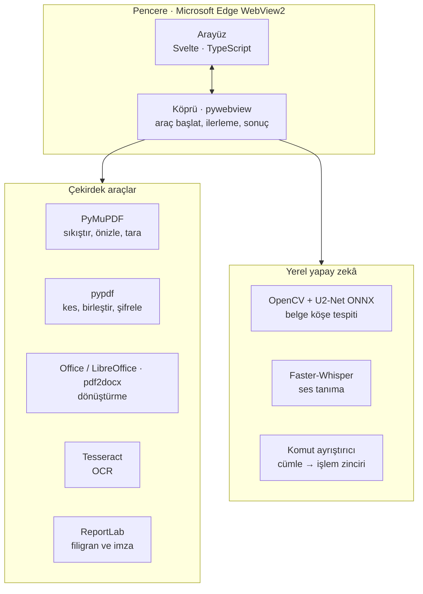
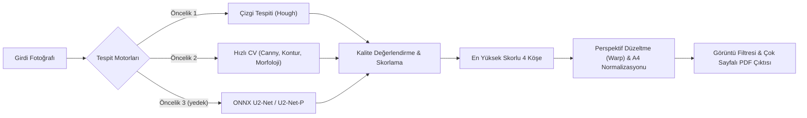

<div align="center">


# PDF Aura

### Windows için çevrimdışı, reklamsız ve yapay zekâ destekli PDF stüdyosu

Sıkıştırın, tarayın, kesin, birleştirin, dönüştürün ve şifreleyin.<br />
Belgeleriniz hiçbir sunucuya yüklenmez; her işlem kendi bilgisayarınızda yapılır.

<br />

<a href="#-kurulum"></a>
<a href="#-kurulum"></a>
<a href="https://github.com/AsirCan/PDFAura/actions/workflows/ci.yml"></a>
<a href="LICENSE"></a>
<br />
<a href="#-gizlilik"></a>
<a href="#-gizlilik"></a>
<a href="#-arayüz"></a>
<a href="#-nasıl-çalışır"></a>

<br />

[**Özellikler**](#-özellikler) &nbsp;•&nbsp;
[**Tanıtım videoları**](#-yakından-bakış) &nbsp;•&nbsp;
[**Kurulum**](#-kurulum) &nbsp;•&nbsp;
[**Nasıl çalışır?**](#-nasıl-çalışır) &nbsp;•&nbsp;
[**SSS**](#-sık-sorulan-sorular) &nbsp;•&nbsp;
[**Yol haritası**](#-yol-haritası)

</div>

<br />

https://github.com/user-attachments/assets/69b6c403-c3e8-44f5-a4e7-e962c4745e03

<p align="center"><sub>Yedi araç tek pencerede. Tema ve dil anında değişir; yeniden başlatma gerekmez.</sub></p>

---

## ✨ Özellikler

Çevrim içi PDF araçlarının çoğu dosyanızı uzak bir sunucuya yükler, reklam gösterir, dosya boyutunu sınırlar ya da abonelik ister. **PDF Aura** bunların hiçbirini yapmaz: masaüstünüzde çalışan, reklamsız ve sınırsız bir araç setidir.

<table>
  <tr>
    <td width="33%" valign="top">
      <h3>🔒 Belgeleriniz sizde kalır</h3>
      Sıkıştırma, dönüştürme, şifreleme ve tarama tamamen yerelde yapılır. Hesap, bulut ya da izleyici yoktur.
    </td>
    <td width="33%" valign="top">
      <h3>📷 Telefonla belge tarama</h3>
      Fotoğraftaki kâğıdın köşelerini bulur, perspektifi düzeltir ve gölgeleri temizleyerek çok sayfalı bir PDF üretir.
    </td>
    <td width="33%" valign="top">
      <h3>🗜️ Gerçek sıkıştırma</h3>
      Dört kalite profiliyle taranmış bir sözleşme 5,3 MB'tan 0,5 MB'a iner. Ek program kurmanız gerekmez; önceki ve sonraki boyutu ekranda görürsünüz.
    </td>
  </tr>
  <tr>
    <td width="33%" valign="top">
      <h3>🔄 Tek yerde dönüştürme</h3>
      PDF ↔ Word, Excel, PowerPoint, resim ve düz metin. Office dosyaları için Microsoft Office ya da ücretsiz LibreOffice kullanılır.
    </td>
    <td width="33%" valign="top">
      <h3>🎙️ Konuşarak komut verin</h3>
      <i>"rapor.pdf ilk 3 sayfayı ayır"</i> yazın ya da söyleyin. Ses tanıma yerel Faster-Whisper modeliyle çalışır.
    </td>
    <td width="33%" valign="top">
      <h3>🎨 Modern arayüz</h3>
      Açık, koyu ve sistem teması, anında değişen 14 arayüz dili, sürükle-bırak, canlı önizleme ve klavye kısayolları.
    </td>
  </tr>
</table>

### Bir bakışta tüm araçlar

| Araç | Neler yapabilirsiniz? |
| :--- | :--- |
| 📷 **Belge Tara** | Fotoğraftan PDF, yapay zekâ destekli 4 köşe tespiti, büyüteçli köşe düzenleme, tam ekran kırpma, sayfa sıralama ve adlandırma, 5 görüntü filtresi, oturumun otomatik kaydı |
| 🗜️ **Sıkıştır** | `screen`, `ebook`, `printer` ve `prepress` profilleri (72–300 dpi), sonuç boyutunun raporu |
| ✂️ **Düzenle** | Sayfa aralığı kesme, sınırsız PDF birleştirme (Yukarı/Aşağı ile sıralama), sayfa silme, 90°/180°/270° döndürme ve yeniden sıralama |
| 🔄 **Dönüştür** | PDF → Resim (PNG/JPG, DPI seçimi), Resim → PDF, PDF → Word, Word / Excel / PowerPoint → PDF, PDF → Metin |
| 🔐 **Güvenlik** | AES-256 parola koruması, parola kaldırma, Türkçe karakter destekli metin filigranı |
| 🧰 **Gelişmiş** | Dahili PDF önizleyici, Tesseract OCR, meta veri düzenleme ve temizleme, sayfa ve koordinat seçerek görsel imza basma |
| 📦 **Toplu İşlemler** | Bir klasördeki tüm PDF'leri sıkıştırma, dönüştürme ya da şablonla yeniden adlandırma, işlem günlüğü |
| 🤖 **Aura Asistan** | Yazılı ve sesli Türkçe/İngilizce komutlar, yanıtın ekranda gösterilmesi ve sesli okunması |

---

## 🎬 Yakından bakış

Aşağıdaki videolar uygulamanın güncel sürümünden kaydedildi. Her işlem gerçekten çalıştırıldı; belgeler kurgusal örneklerdir.

### 1. Akıllı belge tarayıcı

> **Telefonla çektiğiniz fişleri, faturaları ve sözleşmeleri tarayıcı kalitesinde PDF'e dönüştürün.**

Fotoğrafları pencereye sürükleyin. PDF Aura kâğıdın sınırlarını bulur; yanlış yakaladığı köşeyi büyüteçle tutup doğru yere çekebilirsiniz. **Temiz Belge** filtresi arka planı beyazlatır ve gölgeleri siler. Sayfaları sürükleyerek sıralayabilir, çift tıklayarak adlandırabilirsiniz. Çalışmanız otomatik kaydedilir; uygulama kapansa bile kaldığınız yerden devam edersiniz.

https://github.com/user-attachments/assets/3c7046e0-02d4-46d9-84ea-adf2d5f187df

### 2. PDF sıkıştırma

> **Görüntü kalitesini koruyarak dosya boyutunu küçültün.**

E-posta için `screen`, günlük kullanım için `ebook`, baskı için `printer` ya da matbaa için `prepress`. Görseller profile uygun çözünürlüğe indirilip yeniden kodlanır, yazı tipleri yalnızca kullanılan karakterlere indirgenir; metin metin olarak kalır. Sıkıştırma uygulamanın içinde yapılır, Ghostscript gibi ayrı bir program gerekmez. Sonuç özgün dosyadan büyük çıkarsa özgün dosya korunur. İşlem bitince özgün ve yeni boyut yan yana gösterilir; çıktıyı ya da klasörünü tek tıkla açabilirsiniz.

https://github.com/user-attachments/assets/3c140a51-589b-491f-bbd2-dc0c5b5863c4

### 3. Sayfa yönetimi: kes, birleştir, düzenle

> **Belgelerinizi istediğiniz gibi parçalayın, birleştirin ve yeniden düzenleyin.**

Bir rapordan yalnızca ihtiyacınız olan sayfaları ayırın, birden fazla PDF'i istediğiniz sırada tek dosyada toplayın. Düzenle sekmesinde sayfa silebilir, döndürebilir ve sayfa sırasını değiştirebilirsiniz.

https://github.com/user-attachments/assets/0a3c7d6d-ff58-4bde-b2dd-aab1fbc5e70c

### 4. Format dönüştürücü

> **Office belgeleri, görseller ve PDF arasında tek panelden geçiş yapın.**

PDF'i düzenlenebilir bir Word belgesine çevirin, Word, Excel ve PowerPoint dosyalarını PDF yapın, sayfaları yüksek çözünürlüklü PNG/JPG olarak dışa aktarın ya da metni `.txt` olarak alın. Microsoft Office kurulu değilse LibreOffice otomatik devreye girer.

https://github.com/user-attachments/assets/0010c333-fc48-4951-bdb3-5547d34adf95

### 5. Güvenlik ve filigran

> **Gizli belgeleri işaretleyin ve parolayla kilitleyin.**

Sayfalara "GİZLİ" gibi bir filigran ekleyin, ardından belgeyi AES-256 ile şifreleyin. Parolasını bildiğiniz bir PDF'in korumasını da aynı yerden kaldırabilirsiniz.

https://github.com/user-attachments/assets/4247ff39-6775-4c29-82f6-95443cc05561

### 6. Gelişmiş araçlar: önizleme, OCR, meta veri, imza

> **Belgeyi inceleyin, metnini çıkarın, künyesini düzenleyin, imzanızı basın.**

Dahili önizleyicide sayfalar arasında gezinin ve yakınlaştırın. Tesseract OCR ile taranmış PDF'lerdeki metni çıkarın (Tesseract'ı uygulama içinden kurabilirsiniz). Başlık, yazar, konu ve oluşturan bilgilerini düzenleyin ya da tamamen temizleyin. İmza görselinizi seçtiğiniz sayfaya ve konuma yerleştirin.

https://github.com/user-attachments/assets/86de8cc3-d30f-45af-a1d2-6057a29d2d49

### 7. Toplu işlemler

> **Bir klasör dolusu belgeyi tek seferde işleyin.**

Klasörü pencereye bırakın; içindeki tüm PDF'leri sıkıştırın, resme ya da PDF'e dönüştürün veya `Fatura_[TARIH]_[ORIJINAL_AD]_[SIRA]` gibi bir şablonla yeniden adlandırın. Şablonda `[ORIJINAL_AD]`, `[SAYFA_SAYISI]`, `[BOYUT]`, `[SIRA]` ve `[TARIH]` kullanılabilir. Kaç dosyanın başarıyla işlendiği günlükte görünür.

https://github.com/user-attachments/assets/b3820c41-da50-4bec-a2f9-13538d9acdbc

### 8. Aura Asistan: yazılı ve sesli komutlar

> **Menülerde gezinmeden, ne istediğinizi söyleyin.**

Sağ üstteki komut çubuğuna yazın (<kbd>Ctrl</kbd>+<kbd>K</kbd>) ya da mikrofon düğmesine basılı tutup konuşun. Asistan dosyayı Masaüstü, Belgeler ve İndirilenler klasörlerinde bulur, işlemi yapar; yanıtı hem ekranda gösterir hem sesli okur.

https://github.com/user-attachments/assets/b58a1591-12c0-4911-ae4b-38f51585a589

Çalışan örnek komutlar:
- *"rapor.pdf dosyasını sıkıştır"*
- *"rapor.pdf ilk 3 sayfayı ayır"*
- *"a.pdf ve b.pdf dosyalarını birleştir"*
- *"rapor.pdf dosyasını Word'e çevir"*
- *"rapor.pdf dosyasını abc123 ile şifrele"*
- *"Masaüstündeki sözleşmeyi sıkıştır"* (uzantısız ad Masaüstü / Belgeler / İndirilenler klasörlerinde aranır)

Arayüz İngilizceyken İngilizce komutlar da anlaşılır (*"compress report.pdf"*).

> [!NOTE]
> Ses tanıma modeli mikrofon ilk kez kullanıldığında yüklenir ve bu ilk yükleme için (~460 MB) internet bağlantısı gerekir. Model indirildikten sonra tanıma tamamen çevrimdışı çalışır. Yazılı komutlar için hiçbir indirme gerekmez.

---

## 🎨 Arayüz

- **Kenar çubuğunda yedi araç.** <kbd>Ctrl</kbd>+<kbd>1</kbd> … <kbd>Ctrl</kbd>+<kbd>7</kbd> ile araçlar arasında geçersiniz. Son üretilen dosyalar da kenar çubuğunda listelenir.
- **Açık, koyu ve sistem teması.** Sistem seçeneği Windows'un uygulama modunu izler; değişiklik anında uygulanır.
- **14 arayüz dili:** Türkçe, English, 中文, हिन्दी, Español, العربية, Français, বাংলা, Português, Русский, اردو, Bahasa Indonesia, Deutsch, 日本語. İlk açılışta Windows dilinize göre seçilir; değiştirdiğinizde yeniden başlatmadan uygulanır. Arapça ve Urduca sağdan sola gösterilir.
- **Sürükle-bırak her yerde.** PDF'leri, fotoğrafları ve klasörleri doğrudan pencereye bırakın.
- **Canlı önizleme paneli.** Seçtiğiniz PDF'in ilk sayfası, sayfa sayısı ve boyutu hemen görünür.
- **Sistem tepsisi.** İsterseniz pencereyi kapatınca uygulama tepside çalışmaya devam eder.
- **Klavyeyle de kullanılır.** Her denetime <kbd>Tab</kbd> ile gidilir; odak halkası yalnızca klavye kullanırken görünür.

### Klavye kısayolları

| Kısayol | İşlev |
| :--- | :--- |
| <kbd>Ctrl</kbd>+<kbd>1</kbd> … <kbd>Ctrl</kbd>+<kbd>7</kbd> | Sıkıştır, Düzenle, Belge Tara, Dönüştür, Güvenlik, Gelişmiş, Toplu İşlemler |
| <kbd>Ctrl</kbd>+<kbd>K</kbd> | Aura Asistan komut çubuğuna geç |
| <kbd>Ctrl</kbd>+<kbd>,</kbd> | Ayarlar |
| <kbd>←</kbd> <kbd>→</kbd> · <kbd>PgUp</kbd> <kbd>PgDn</kbd> | Önizleyicide önceki / sonraki sayfa |
| <kbd>Home</kbd> · <kbd>End</kbd> | Önizleyicide ilk / son sayfa |
| <kbd>+</kbd> · <kbd>-</kbd> | Önizleyicide yakınlaştır / uzaklaştır |
| <kbd>Esc</kbd> | Önizleyiciyi, tam ekran kırpmayı ya da Ayarlar'ı kapat |
| <kbd>F2</kbd> | Belge Tara: seçili sayfaya ad ver (<kbd>Tab</kbd> ile sonrakine geçer) |
| <kbd>Alt</kbd>+<kbd>←</kbd> <kbd>→</kbd> · <kbd>Del</kbd> | Belge Tara: sayfayı öne / arkaya taşı · kaldır |
| <kbd>←</kbd> <kbd>↑</kbd> <kbd>→</kbd> <kbd>↓</kbd> | Belge Tara: seçili köşe noktasını 1 piksel kaydır (<kbd>Shift</kbd> ile 10) |

---

## 🧠 Nasıl çalışır?

PDF Aura bir masaüstü uygulamasıdır: belgeler üzerindeki her işi Python yapar, pencereyi Windows'ta hazır bulunan **Microsoft Edge WebView2** çizer. Arayüz Svelte ve TypeScript ile yazılmıştır ve uygulamanın içinde gelir; internetten hiçbir şey yüklenmez. Pencere ile Python arasındaki tek yol [pywebview](https://pywebview.flowrl.com/)'in köprüsüdür: arayüz bir aracı adıyla başlatır, Python girdiyi denetler, işi arka planda yapar ve ilerlemeyi pencereye bildirir. Bu sırada arayüz donmaz ve çoğu işlemi yarıda iptal edebilirsiniz.



Sayfa önizlemeleri ve tarayıcıdaki fotoğraflar da Python'da çizilir ve pencereye yalnızca bu bilgisayarın içinden (`127.0.0.1`) verilir.

### Belge tarayıcının köşe tespiti

Köşe tespitinde **hibrit bir boru hattı** kullanılır. Hızlı klasik yöntemler önce denenir; derin öğrenme modeli yedek olarak devreye girer:



Bulunan her dörtgen dört ölçüte göre puanlanır:

1. **Kenar skoru (%35):** Köşelerin fotoğraf kenarlarına uzaklığı ve netliği.
2. **Alan skoru (%25):** Belgenin fotoğrafın %15–95'lik mantıklı bir alanını kaplaması.
3. **En-boy oranı (%20):** A4 / Letter oranlarına uygunluk (1:1 ile 3:1 arası).
4. **Açı skoru (%20):** Dört köşenin 90 dereceye yakınlığı.

Tarama filtreleri: **Temiz Belge** (arka plan bölme), **Siyah-Beyaz** (adaptif eşikleme), **Gri Tonlama** (CLAHE), **Keskin Belge** ve **Orijinal** (yalnızca kırpma).

---

## 🔒 Gizlilik

- Belgeleriniz hiçbir sunucuya gönderilmez; tüm PDF işlemleri bilgisayarınızda yapılır.
- Pencerenin sayfası ve önizlemeler yalnızca bu bilgisayarın içinden (`127.0.0.1`), her açılışta değişen bir anahtarla verilir; sıkı bir içerik güvenlik politikası (CSP) pencerenin dışarıdan hiçbir şey yüklemesine izin vermez. Pencereden bilgisayar dışına istek gitmediğini her değişiklikte otomatik bir test denetler.
- Uygulamada reklam, hesap, telemetri ya da üçüncü taraf izleyici yoktur.
- İnternet yalnızca sizin başlattığınız indirmeler için kullanılır: sesli asistanın ilk kullanımında Whisper modeli, `download_models.py` ya da Ayarlar üzerinden indirilen yapay zekâ modelleri ve Gelişmiş sekmesinden başlatılan Tesseract kurulumu.
- Ayarlar ve son dosyalar listesi `%APPDATA%\PDFAura` klasöründe tutulur. Son dosyalar listesini Ayarlar'dan temizleyebilirsiniz.

---

## 📥 Kurulum

### Sistem gereksinimleri

| Bileşen | Minimum | Önerilen |
| :--- | :--- | :--- |
| **İşletim sistemi** | Windows 10 (64-bit) | Windows 11 (64-bit) |
| **İşlemci** | Intel Core i3 / AMD Ryzen 3 | Intel Core i5 / AMD Ryzen 5 veya üzeri |
| **Bellek** | 4 GB | 8 GB veya üzeri |
| **Disk alanı** | ~500 MB (temel kurulum) | ~1 GB (tüm yapay zekâ modelleriyle) |
| **Microsoft Edge WebView2** | Windows 11'de ve güncel Windows 10'da hazır gelir | Yoksa kurulum dosyası indirip kurar |
| **Python** *(kaynak koddan çalıştırmak için)* | Python 3.10 | Python 3.12 (64-bit) |
| **Node.js** *(kaynak koddan çalıştırmak için)* | Node.js 22 | Node.js 24 |

### Seçenek A: Kurulum dosyası

Hazır kurulum dosyası `PDFAura-Setup.exe`, [Releases](https://github.com/AsirCan/PDFAura/releases) sayfasında yayınlanır. Kurulum sihirbazını çalıştırın, ardından Başlat menüsündeki **PDF Aura** simgesiyle uygulamayı açın. Henüz bir sürüm yayınlanmadıysa Seçenek B ile birkaç komutla çalıştırabilir ya da aşağıdaki **Kurulum dosyasını derleme** adımlarıyla kurulum dosyasını kendiniz üretebilirsiniz.

### Seçenek B: Kaynak koddan çalıştırma

```powershell
# 1. Depoyu klonlayın
git clone https://github.com/AsirCan/PDFAura.git
cd PDFAura

# 2. Sanal ortam oluşturup etkinleştirin
python -m venv venv
.\venv\Scripts\Activate.ps1

# 3. Bağımlılıkları yükleyin
pip install --upgrade pip
pip install -r requirements.txt

# 4. Arayüzü derleyin (Node.js yalnızca derlerken gerekir, uygulamaya girmez)
cd web
npm ci
npm run build
cd ..

# 5. Belge tarayıcının yapay zekâ modelini indirin (~4.7 MB)
python download_models.py --skip-optional

# 6. Uygulamayı başlatın
python main.py
```

Sonraki açılışlarda proje klasöründeki `baslat.bat` dosyasına çift tıklamanız yeterlidir. Arayüzün kaynağını (`web/src`) değiştirirseniz `npm run build` ile yeniden derleyin.

### Harici bileşenler

| Bileşen | Ne için? | Durum |
| :--- | :--- | :--- |
| Microsoft Office veya [LibreOffice](https://www.libreoffice.org/download/) | Word, Excel ve PowerPoint → PDF | İkisinden biri yeterli. Office yoksa LibreOffice kullanılır. |
| [Tesseract OCR](https://github.com/UB-Mannheim/tesseract/wiki) | Taranmış PDF'lerden metin çıkarma | İsteğe bağlı. Gelişmiş sekmesinden tek tıkla kurulabilir. Kurulu dil paketleri kullanılır; Türkçe yoksa İngilizce ile çalışır. |

### Yapay zekâ modelleri

| Model dosyası | Boyut | Donanım | Açıklama |
| :--- | :--- | :--- | :--- |
| **`u2netp_document.onnx`** | ~4.7 MB | CPU / düşük sistemler | **Önerilen.** Hafif ve hızlı köşe tespiti. |
| **`u2net_document.onnx`** | ~168 MB | GPU / güçlü CPU | Tam ölçekli model (isteğe bağlı, `python download_models.py`). |
| Faster-Whisper | ~460 MB | CPU | Sesli asistan ilk kullanımda indirir. |

Modeller `models/` klasörüne indirilir ([ayrıntılar](models/README.md)). Tarayıcı modeli yoksa uygulama yine çalışır ve klasik bilgisayarlı görü (OpenCV) yöntemlerini kullanır.

<details>
<summary><b>Kurulum dosyasını derleme</b> (PyInstaller + Inno Setup)</summary>

<br />

1. Arayüzü derleyip uygulamayı paketleyin:

   ```powershell
   pip install -r requirements-dev.txt
   cd web; npm ci; npm run build; cd ..
   pyinstaller --noconfirm PDFAura.spec
   ```

   Çıktı: `dist\PDFAura\PDFAura.exe`

2. [Inno Setup](https://jrsoftware.org/isdl.php) kuruluyken kurulum dosyasını üretin:

   ```powershell
   iscc setup.iss
   ```

   Çıktı: `dist\PDFAura-Setup.exe`. Bilgisayarda WebView2 çalışma zamanı yoksa kurulum, Microsoft'un küçük kurucusunu indirip çalıştırır.

</details>

---

## ❓ Sık sorulan sorular

<details>
<summary><b>İnternet bağlantısı gerekiyor mu?</b></summary>

<br />

Hayır. PDF işlemlerinin hepsi çevrimdışı çalışır. İnternet yalnızca isteğe bağlı indirmeler için gerekir: sesli asistanın ses tanıma modeli (ilk kullanımda ~460 MB), tarayıcının yapay zekâ modeli ve Tesseract kurulumu.

</details>

<details>
<summary><b>Sıkıştırdığım dosya neden pek küçülmedi?</b></summary>

<br />

PDF'lerdeki boyutun büyük kısmı görsellerden gelir; sıkıştırma da en çok onları küçültür. Taranmış belgeler ve fotoğraflı PDF'ler belirgin şekilde küçülür, yalnızca metinden oluşan bir PDF ise zaten küçüktür. Daha küçük dosya için `screen` profilini deneyin. Sonuç özgün dosyadan büyük çıkacaksa PDF Aura özgün dosyayı korur, böylece dosya hiçbir zaman büyümez.

</details>

<details>
<summary><b>Word, Excel ya da PowerPoint dosyası PDF'e dönüşmüyor.</b></summary>

<br />

Bu dönüşümler için Microsoft Office veya ücretsiz LibreOffice kurulu olmalıdır. PDF → Word dönüşümü ise ikisine de ihtiyaç duymaz.

</details>

<details>
<summary><b>Belge tarayıcı köşeleri yanlış buldu.</b></summary>

<br />

Köşe noktalarını sürükleyerek kâğıdın köşelerine oturtun; sürüklerken açılan büyüteç ince ayarı kolaylaştırır. Daha hassas çalışmak için **Tam Ekran Kırp**'ı kullanabilir, **Otomatik Algıla** ile tespiti yeniden çalıştırabilir ya da **Sıfırla** ile baştan başlayabilirsiniz. Düz, kontrastlı bir zemin üzerinde çekilen fotoğraflar en iyi sonucu verir.

</details>

<details>
<summary><b>Arayüz dilini nasıl değiştiririm?</b></summary>

<br />

Ayarlar (<kbd>Ctrl</kbd>+<kbd>,</kbd>) → **Uygulama Dili**'nden dili seçin. Yeni dil hemen uygulanır; uygulamayı yeniden başlatmanız gerekmez.

</details>

<details>
<summary><b>Açılışta "WebView2 bulunamadı" uyarısı çıkıyor.</b></summary>

<br />

PDF Aura'nın penceresini Microsoft Edge WebView2 çalışma zamanı çizer. Windows 11'de ve güncel Windows 10'da hazır gelir; eksikse kurulum dosyası kendisi kurar. Kaynak koddan çalıştırıyorsanız ya da kurulumu bir şirket ağı engellediyse çalışma zamanını [Microsoft'un sayfasından](https://developer.microsoft.com/microsoft-edge/webview2/) (Evergreen Bootstrapper) kurun.

</details>

<details>
<summary><b>Pencereyi kapattım ama uygulama kapanmadı.</b></summary>

<br />

**"X (Kapat) tuşuna basıldığında Sistem Tepsisine küçült"** ayarı açıksa PDF Aura tepside çalışmaya devam eder. Tepsi simgesine tıklayarak (ya da sağ tıklayıp **Aç**) pencereyi geri getirebilir, sağ tık → **Çıkış** ile uygulamayı tamamen kapatabilirsiniz. Bu davranışı Ayarlar'dan kapatabilirsiniz.

</details>

---

## 🧭 Yol haritası

- [x] Canlı PDF önizleme ve tam ekran önizleyici
- [x] Token tabanlı tasarım sistemiyle yenilenen arayüz
- [x] Açık / koyu tema (Windows ayarını izleyen *Sistem* seçeneğiyle)
- [x] 14 arayüz dili
- [x] U2-Net ONNX tabanlı belge tarayıcı ve çok sayfalı oturum kaydı
- [x] Yerel Faster-Whisper sesli komut asistanı
- [x] Windows sistem tepsisi entegrasyonu
- [x] Microsoft Office yoksa LibreOffice ile Office dönüştürme
- [x] Ghostscript gerektirmeyen, uygulama içi PDF sıkıştırma
- [x] WebView2 + Svelte ile yeniden yazılan arayüz: dil ve tema anında değişir, uzun işlerde pencere donmaz
- [ ] Windows Gezgini sağ tık menüsü (*"PDF Aura ile Sıkıştır / Dönüştür"*)
- [ ] İsteğe bağlı yerel LLM entegrasyonu (Ollama / llama.cpp ile belge özeti)

Bir fikriniz mi var? [Issue açarak](https://github.com/AsirCan/PDFAura/issues/new) önerin.

---

## 🤝 Katkıda bulunma

Hata bildirimleri, öneriler ve pull request'ler memnuniyetle karşılanır.

1. Depoyu fork'layın ve bir dal açın.
2. Geliştirme bağımlılıklarını yükleyin: `pip install -r requirements-dev.txt`, ardından `web` klasöründe `npm ci`
3. Değişikliğinizi yapın ve testleri çalıştırın: `pytest`; arayüz için `web` klasöründe `npm run lint`, `npm run check` ve `npm test`. Gerçek pencereyi uçtan uca deneyen testler `npm run build` sonrasında `pytest -m e2e` ile çalışır.
4. Pull request açın. Testler her push'ta GitHub Actions üzerinde otomatik çalışır.

---

## 📄 Lisans ve teşekkürler

PDF Aura [MIT lisansı](LICENSE) ile dağıtılır; kişisel ve ticari amaçlarla özgürce kullanılabilir, değiştirilebilir ve dağıtılabilir.

PDF Aura şu açık kaynak projelerin üzerine kuruludur: [pypdf](https://github.com/py-pdf/pypdf), [PyMuPDF](https://github.com/pymupdf/PyMuPDF), [OpenCV](https://opencv.org/), [ONNX Runtime](https://onnxruntime.ai/), [U2-Net](https://github.com/xuebinqin/U-2-Net), [Faster-Whisper](https://github.com/SYSTRAN/faster-whisper), [Tesseract](https://github.com/tesseract-ocr/tesseract), [pdf2docx](https://github.com/ArtifexSoftware/pdf2docx), [ReportLab](https://www.reportlab.com/), [pywebview](https://github.com/r0x0r/pywebview), [Svelte](https://svelte.dev/) ve [Vite](https://vite.dev/). Pencereyi Microsoft Edge WebView2 çizer. LibreOffice ve Tesseract ayrı programlar olarak çağrılır ve kendi lisanslarıyla dağıtılır.

<div align="center">

<br />


**PDF Aura** ile belgeleriniz güvende, kontrol sizde.

Geliştirici: [AsirCan](https://github.com/AsirCan) &nbsp;•&nbsp; Beğendiyseniz bir ⭐ bırakmayı unutmayın!

[↑ Başa dön](#pdf-aura)

</div>
